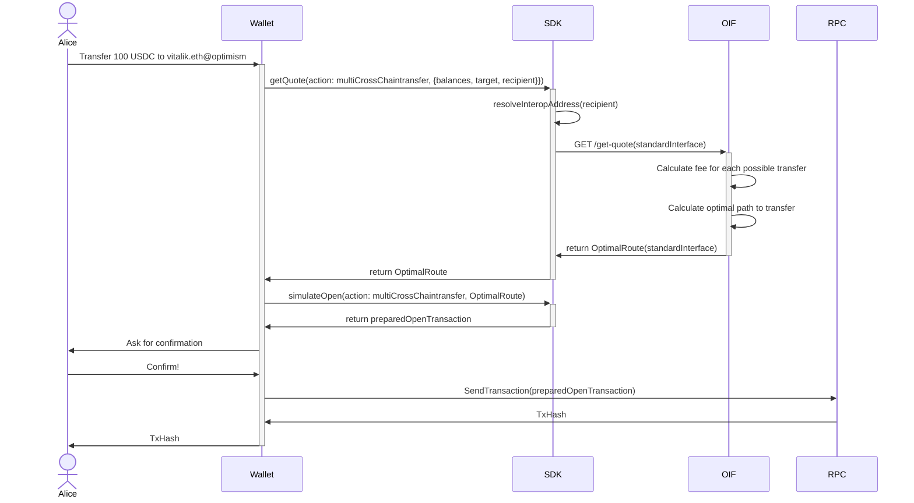
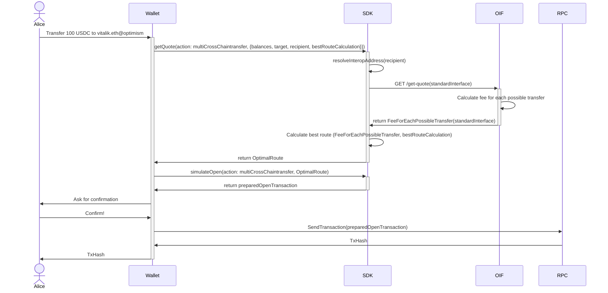

# GetQuote API

# Background

Cross-chain bridge protocols typically expose `getQuote` endpoints that provide users with transfer cost estimates and route information. These endpoints serve as the foundation for user experience in cross-chain applications, allowing wallets and dApps to display accurate fees and timing before users commit to transactions.

## **Limitations of Current Approaches**

### **Single-Chain Source Assumption**

All existing quote endpoints assume users have their **entire transfer amount on a single source chain**. This creates suboptimal UX when users have fragmented balances across multiple chains.

### **Lack of API Standardization**

Each bridge protocol implements different quote interfaces, creating integration challenges:

**Response Format Variations:**

- Some return `gas` estimates, others return `gasPrice`
- Fee breakdowns vary: `totalFee` vs `relayerFee + lpFee + gasFee`
- Time estimates: seconds vs blocks vs missing entirely
- Different error handling and validation responses

**Integration Complexity:**

Wallets and aggregators must maintain separate adapters for each bridge's unique API, making multi-bridge comparison costly and error-prone.

# General

We are developing a **standardized interface for** multi-source transfers (Universal Balance Transfer) **quote endpoints** that addresses the fragmentation and limitations present in current bridge protocols. This standard defines unified input and output schemas for `getQuote`endpoints, enabling consistent integration across multiple bridge providers regardless of their underlying implementation.

Our approach focuses on creating a common language for cross-chain quote requests and responses, allowing wallets and applications to work seamlessly with any compliant bridge protocol.

## **Purpose**

The primary purpose of this standardization effort is to **eliminate the integration complexity** that currently exists in the cross-chain ecosystem. By establishing a common interface for quote endpoints, we aim to:

- **Reduce Development Overhead**: Wallets and dApps can integrate with multiple bridge protocols using a single, consistent API interface
- **Enable Seamless Bridge Comparison**: Allow applications to easily compare quotes from different providers without maintaining separate adapters
- **Improve User Experience**: Provide consistent and predictable quote information across all bridge protocols
- **Foster Ecosystem Interoperability**: Create a foundation for cross-bridge collaboration and competition based on performance rather than integration difficulty

# In-Depth

## **Core Design Decision: Server-Side vs Client-Side Route Calculation**

A fundamental architectural decision for the standardized `getQuote` endpoint is determining **where the route optimization occurs**. We have identified two primary approaches, each with distinct trade-offs:

## **Approach 1: Server-Side Route Calculation**

In this approach, the endpoint receives user balance information and returns **a single optimized route** that the wallet should execute. The server can implement various routing algorithms including **Greedy Algorithm**, **Dynamic Programming**, **Dijkstra's Algorithm**, **Multi-Objective Optimization**, **Genetic Algorithm**, **Simulated Annealing**, **Ant Colony Optimization**, and *A Search Algorithm**.

### **Input Schema:**

```tsx
interface ServerSideQuoteRequest {
  // Map of chain ID to user's token balance on that chain
  // chainId: numeric blockchain identifier (e.g., 1 = Ethereum, 137 = Polygon)
  // balance: amount as integer string in wei (smallest unit of the token)
  // tokenAddress: token contract address (hex string, e.g., "0x...")
  // priority: which token the user prefeer to spend (e.g., 0 = Max Priority)
  userBalances: Map<chainId, {balance, tokenAddress, priority}>

  // Desired amount to receive on target chain (as integer string in wei)
  targetAmount: string

  // Destination blockchain ID where user wants to receive tokens
  targetChain: chainId

  // Destination token contract address (hex string, e.g., "0x...")
  targetTokenAddress: string

  // Optional: specify which routing algorithm to use
  algorithm?: 'greedy' | 'dynamic-programming' | 'dijkstra' | 'multi-objective' | 'genetic' | 'simulated-annealing' | 'ant-colony' | 'a-star'

  // Optional user preferences for route optimization
  userPreferences?: {
    // Whether to prioritize speed over cost (boolean)
    prioritizeSpeed: boolean

    // Maximum acceptable slippage (percentage, e.g., 0.5 = 0.5%)
    maxSlippage: number

    // Weight for cost optimization (0-1, where 1 = cost is most important)
    costWeight: number
  }
}

```

### **Output Schema:**

```tsx
interface ServerSideQuoteResponse {
  route: {
    // Array of bridge transfers needed to complete the route
    steps: Array<{
      // Source blockchain ID for this step
      sourceChain: chainId
      
      // Source token address for this step
      sourceTokenAddress: Hex

      // Amount to bridge from this chain (as integer string in wei)
      amount: string

      // Bridge fee for this step (in wei of source chain's native token)
      fee: string

      // Estimated gas cost (in gas units, not wei)
      gasEstimate: string
      
      // Estimated gas cost in USD (in USD)
      usdGasEstimate: string

      // Estimated completion time for this step (in seconds)
      timeEstimate: number

      // Name/identifier of the bridge provider (string)
      bridgeProvider: string
    }>

    // Sum of all fees across all steps (in wei of respective native tokens)
    totalFee: string

    // Sum of all gas estimates (in gas units)
    totalGasEstimate: string
    
    // Sum of all USD gas estimates (decimal representation in USD)
    usdTotalGasEstimate: string

    // Estimated time for entire route completion (in seconds)
    estimatedCompletionTime: number
  }

  // Algorithm used to calculate this route
  algorithmUsed: string

  // Unique identifier for this quote (for tracking/execution)
  quoteId: string

  // Unix timestamp when this quote expires
  validUntil: timestamp
}

```

### **Advantages:**

- **Simplified Integration**: Wallets receive ready-to-execute instructions
- **Optimized Performance**: Server can run complex algorithms without client constraints
- **Reduced Bandwidth**: Minimal data transfer for simple use cases
- **Centralized Logic**: Route optimization improvements benefit all clients immediately
- **Algorithm Flexibility**: Different algorithms can be tested and compared server-side

### **Disadvantages:**

- **Limited Transparency**: Users cannot see alternative options or understand trade-offs
- **Reduced Control**: Wallets cannot implement custom routing preferences
- **Trust Dependency**: Users must trust the server's optimization choices
- **Black Box Experience**: Difficult to debug or explain routing decisions

## **Approach 2: Client-Side Route Calculation**

In this approach, the endpoint returns **comprehensive bridge information** allowing wallets to implement their own routing algorithms. While a complementary **Route endpoint** would calculate the best optimized route based on this data and user preferences.

### **Input Schema:**

```tsx
interface ClientSideQuoteRequest {
  // Array of chain IDs where user might have balances to bridge from and source token address of each chain
  availableSource: {chainId, tokenAddress}[]

  // Destination blockchain ID where user wants to receive tokens
  targetChain: chainId

  // Destination token contract address (hex string, e.g., "0x...")
  targetTokenAddress: string

  // Optional: specific amounts to get quotes for (in wei)
  // If not provided, endpoint returns general fee structure
  amounts?: string[]
}

```

### **Output Schema:**

```tsx
interface ClientSideQuoteResponse {
  // Map of source chain to bridge information for that route
  bridgeOptions: Map<sourceChain, {
    // Bridge fee
    // pct: percentage fee that bridge will charge
    // fix: fixed fee in wei bridge will charge
    fee: { pct: string, fix: string }

    // Estimated gas cost (in gas units, not wei)
    gasEstimate: string
    
    // Estimated gas cost in USD
    usdGasEstimate: string

    // Estimated transfer completion time (in seconds)
    timeEstimate: number

    // Reliability score based on historical performance (0-1, where 1 = most reliable)
    reliabilityScore: number

    // Expected slippage (percentage, e.g., 0.3 = 0.3%)
    slippage: number

    // Minimum transferable amount (in wei)
    minAmount: string

    // Maximum transferable amount (in wei)
    maxAmount: string

    // Name/identifier of the bridge provider (string)
    bridgeProvider: string
  }>

  // Current gas prices on each chain (in wei per gas unit)
  chainGasPrices: Map<chainId, string>

  // Unique identifier for this quote (for tracking/execution)
  quoteId: string

  // Unix timestamp when this quote expires
  validUntil: timestamp
}

```

### **Advantages:**

- **Maximum Flexibility**: Wallets can implement custom routing logic
- **Full Transparency**: Users can see all available options and trade-offs
- **Innovation Freedom**: Different wallets can compete on routing algorithms
- **User Control**: Advanced users can override automatic suggestions

### **Disadvantages:**

- **Implementation Complexity**: Each wallet must implement routing algorithms
- **Performance Constraints**: Client devices may struggle with complex optimizations
- **Inconsistent UX**: Different wallets may provide vastly different recommendations
- **Higher Bandwidth**: More data transfer required for comprehensive information

### Route Endpoint

In case 

## **Hybrid Approach Consideration**

A potential third option combines both approaches:

```tsx
interface HybridQuoteResponse {
  // Server's recommended optimal route
  recommendedRoute: ServerSideQuoteResponse.route

  // Algorithm used for the recommendation
  algorithmUsed: string

  // Complete bridge information for client-side calculations
  bridgeOptions: ClientSideQuoteResponse.bridgeOptions

  // Current gas prices (in wei per gas unit)
  chainGasPrices: Map<chainId, string>

  // Unique identifier for this quote
  quoteId: string

  // Unix timestamp when this quote expires
  validUntil: timestamp
}

```

This provides both server recommendations and raw data for client customization, but increases response complexity and size.

## Flows

Alice wants to transfer 100 USDC to `vitalik.eth@optimism` but she has:

- 40 USDC on Arbitrum
- 30 USDC on Base
- 90 USDC on Polygon
- 40 USDC on BSC

Multiple routing possibilities exist to achieve the goal of transferring 100 USDC to Optimism. For example, we could use:

- 90 USDC from Polygon
- 10 USDC from Base/BSC/Arbitrum

However, the bridge fee from Polygon to Optimism might be too high, making it better to use:

- 40 USDC from Arbitrum
- 40 USDC from BSC
- 20 USDC from Base

Alternatively, if the wallet prioritizes speed over cost, the optimal route might be:

- 90 USDC from Polygon
- 10 USDC from Base *(specifically Base due to fastest bridge time)*

As mentioned previously, we have two approaches to determine the best route: server-side calculation or client-side calculation.

### **Approach 1: Server-Side Route Calculation**



### **Approach 2: Client-Side Route Calculation**



❗The SDK wont implement any kind of Routing Algorithm, but we could receive one implemented by Wallet to return the best route calculated