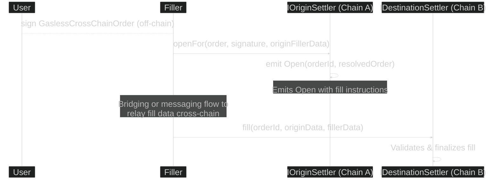
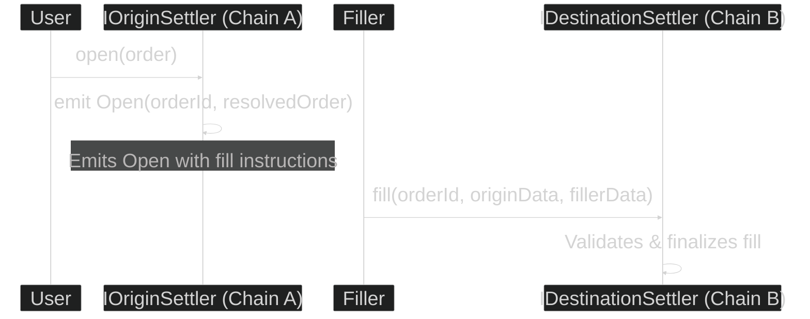
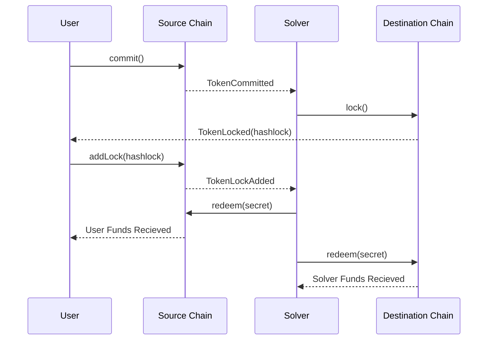

# Intents

An intent is any user request that can be fulfilled by an agent in a fast manner. The user commonly "declares" what outcome they desire (e.g., fund transfer, token swaps) and it is allowed to be completed by solvers under a given pricing, possibly in a competitive environment.

In interoperability, intents are key to enabling "cross-chain swaps," in which the user and solver (or underlying system) exchange assets in both origin and destination domains. This is particularly relevant in cases where users expect to initiate an action in one chain to be completed in another in a matter of seconds, in contrast to typical settlement wait times.

Intents are also considered a proper solution to minimize the consequences of liquidity fragmentation in a world where token representations are not homogeneous nor interconnected across chains.

> [!NOTE]
> After several proposals, the community has converged on **ERC-7683** as the primary standard for intent-based interoperability, aiming to unify how cross-chain orders are created, executed, and settled.

## ERC-7683: Cross Chain Intents Standard

[ERC-7683](https://github.com/ethereum/ERCs/blob/master/ERCS/erc-7683.md) proposes a standard API for cross-chain value-transfer systems. A participant called a "filler" fulfills the intents in the destination initiated by users and is paid through a settlement system. Users are protected since their funds are escrowed in the origin chain and are released when the action is verified, commonly through a message passed and validated.

A CrossChainOrder is initiated (gasless or not gasless) and is resolved even when partitioned into several "legs". Note that the standard does not impose an opinion on the validation mechanism used to verify when an intent is completed.

For a gasless cross-chain Flow:

For an on-chain cross-chain flow:

This standard intentionally does not prescribe the specifics of final settlement logic or how cancellations like revoking an unfilled order should be handled. Implementations may choose to use any cross-chain messaging system.

## The Open Intents Framework: ERC-7683 as a Public Good

While ERC-7683 defines the "what" (the standard API), the **Open Intents Framework (OIF)** provides the "how". It is an open-source public good that offers modular tools to build and deploy intent-based experiences.

Driven by contributors from the Ethereum Foundation, Hyperlane, Across, and others, the OIF aims to accelerate the adoption of the standard by providing:
- **A Reference Implementation of ERC-7683**: Ready-to-use smart contracts that developers can adapt, lowering the barrier to entry.
- **An Open-Source Solver**: A TypeScript application that handles protocol-agnostic features like indexing, transaction submission, and liquidity rebalancing.
- **Composable Smart Contracts**: A suite of pre-built contracts that define the logic for interpreting, executing, and settling intents based on ERC-7683.

By providing this infrastructure as a public good, the OIF allows teams to innovate on the intent layer without needing to build everything from scratch, fostering a more collaborative and decentralized ecosystem.

## Intents with Atomic Swaps

[This proposal](atomic-swaps.md) introduces a mechanism for achieving asset interoperability between Ethereum L2s (and beyond) using Atomic Swaps. The approach does not require a cross-chain messaging protocol, does not introduce new trust assumptions, and remains open and permissionless for any network to participate.

This approach ensures a scalable and trustless mechanism for cross-chain asset transfers without relying on third-party validators or external security mechanisms.
This approach ensures a scalable and trustless mechanism for cross-chain asset transfers without relying on third-party validators or external security mechanisms.
